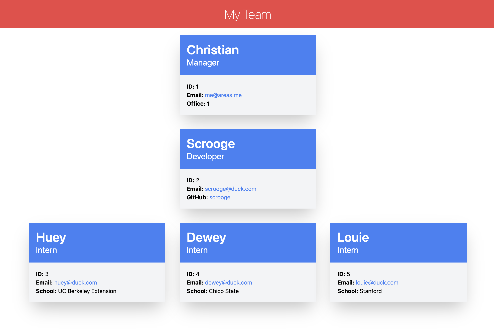

# Team Profile Generator
## Description
A Team Profile Generator that’s a pleasure to use. Start with a manager and add as many developers and interns as you like!

To see it in action, [watch the video](https://drive.google.com/file/d/1KU0bgALVwRsSzYaSwWrsjiuCQpmF-wpe/view).

## Table of Contents
- [Features](#features)
- [Installation](#installation)
- [Usage](#usage)
- [Contribute](#contribute)
- [Tests](#tests)
- [Credits](#credits)
- [License](#license)
- [Questions](#questions)

## Features
- Interactive app that walks you through the process of creating a team profile.
- Generates a responsive HTML page for you.
- Creates links for email and GitHub profiles.

## Installation
Clone the repo and run `npm install`.

## Usage
Run `node index.js`. The app will output your HTML and CSS to the dist/ folder.

## Contribute
Create a PR or send an email.

## Tests
Try it locally before you push your commits! Remember to test a variety of flows (for example, don’t add developer or interns, add only developer, and so on).

## Credits
- Node.js
- Inquirer
- Jest
- Tailwind CSS
- UC Berkeley Boot Camp

## License
See [LICENSE (GNU GPLv3)](./LICENSE).

## Questions
Reach out with questions:

- GitHub: [github.com/areas-boot-camp-challenges](https://github.com/areas-boot-camp-challenges)
- Email: [me@areas.me](mailto:me@areas.me)
